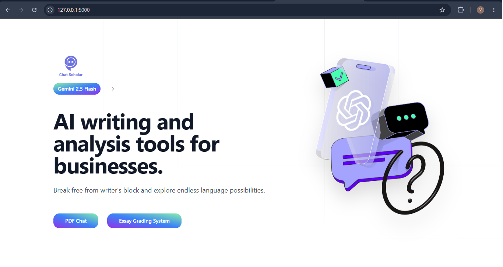

# 📚 ChatScholar GenAI

### AI-Powered Academic Assistant using Flask, Google Gemini, LangChain, and FAISS

ChatScholar GenAI enables users to upload PDF documents, interact with them through natural language, generate essay rubrics(essay rules), and receive AI-assisted responses based on document content.

---

## 🚀 Features

- 📄 Upload one or multiple PDF documents
- 🔍 Extract text from PDFs
- ✂️ Intelligent text chunking
- 🧠 Semantic search using FAISS Vector Store
- 🤖 AI-powered Question Answering with Google Gemini
- 📝 Essay evaluation and grading
- 📊 AI-generated essay rubrics
- 💬 Interactive chat interface
- 🌐 Flask-based responsive web application

---

## 🛠️ Tech Stack

### Backend

- Python
- Flask
- LangChain
- Google Gemini API
- FAISS

### Frontend

- HTML
- CSS
- JavaScript

### Libraries

- PyPDF2
- python-dotenv
- Google Generative AI SDK
- LangChain Community

---

## 📂 Project Structure

```
ChatScholar_GenAI
│
├── app.py
├── requirements.txt
├── README.md
├── .gitignore
├── .env
│
├── data/
│   ├── uploaded PDFs
│
├── templates/
    ├── new_home.html
    ├── new_chat.html
    ├── new_pdf_chat.html
    ├── new_essay_grading.html
    └── new_essay_rubric.html

```


## ⚙️ Installation

### 1 Clone the Repository

```bash
git clone https://github.com/VisheshJain28/ChatScholar_GenAI.git
```

---

### 2 Navigate to Project Folder

```bash
cd ChatScholar_GenAI
```

---

### 3 Create Virtual Environment

Windows

```bash
python -m venv .venv
```

Activate

```bash
.venv\Scripts\activate
```

---

### 4 Install Dependencies

```bash
pip install -r requirements.txt
```

---

### 5 Create Environment File

Create a file named

```
.env
```

Add

```env
GOOGLE_API_KEY=YOUR_API_KEY
```

---

### 6 Run the Application

```bash
python app.py
```

Open your browser

```
http://127.0.0.1:5000
```

---

# 🧠 How It Works

### Step 1

User uploads one or more PDF files.

↓

### Step 2

Text is extracted from the uploaded PDFs.

↓

### Step 3

The extracted text is divided into smaller chunks.

↓

### Step 4

Each chunk is converted into vector embeddings.

↓

### Step 5

Embeddings are stored in a FAISS Vector Database.

↓

### Step 6

When a user asks a question, the system performs semantic similarity search.

↓

### Step 7

The most relevant document chunks are retrieved.

↓

### Step 8

The retrieved context is sent to Google Gemini.

↓

### Step 9

Gemini generates an accurate response grounded in the uploaded documents.

---

# ✨ Application Modules

### 📄 PDF Chat

Upload PDFs and ask questions based on their content.

---

### 📝 Essay Grading

Evaluate essays using AI-generated feedback.

---

### 📊 Essay Rubric Generator

Automatically generate grading rubrics for essays.

---

### 🤖 AI Assistant

Receive contextual responses using Retrieval-Augmented Generation (RAG).

---

# 📸 Screenshots

## Home Page



---

## PDF Chat

(Add Screenshot)

---

## Essay Grading

(Add Screenshot)

---


# 🔒 Environment Variables

```
GOOGLE_API_KEY=YOUR_API_KEY
```


# 📈 Future Improvements

- User authentication
- Chat history
- Persistent vector database
- OCR support for scanned PDFs
- Multiple AI model support
- Voice interaction
- Dark mode
- Document citations

---

# 🤝 Contributing

Contributions are welcome.

Fork the repository, create a new branch, make your changes, and submit a Pull Request.

---

# 📜 License

This project is licensed under the MIT License.

---

